# E-Commerce App
This is a demo e-commerce app.

## Features:
1. Authentication.
2. Show product category.
3. Category wise product list.
4. Product details.
5. Add to cart.
6. Profile section.

## Technologies:
1. Dart programming language.
2. Flutter framework.

## Packages:
1. shared_preferences: ^2.0.15 (For save token in local storage)
2. flutter_riverpod: ^1.0.4 (For state management)
3. http: ^0.13.4 (For http request)
4. image_picker: ^0.8.5+3 (For edit profile image)

## Image Source
https://undraw.co/

## Font
https://fonts.google.com/specimen/Barlow?query=barlow

## Design a simple banner using:
https://www.canva.com/

## API resources: 
https://documenter.getpostman.com/view/5909130/UzBsH4mm
host: https://grapfood.jony.life/api/

## Screenshots

  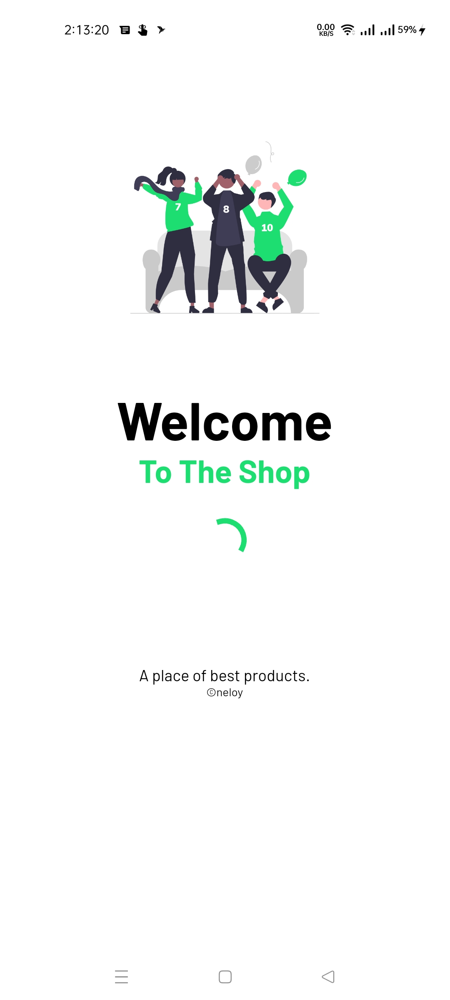
  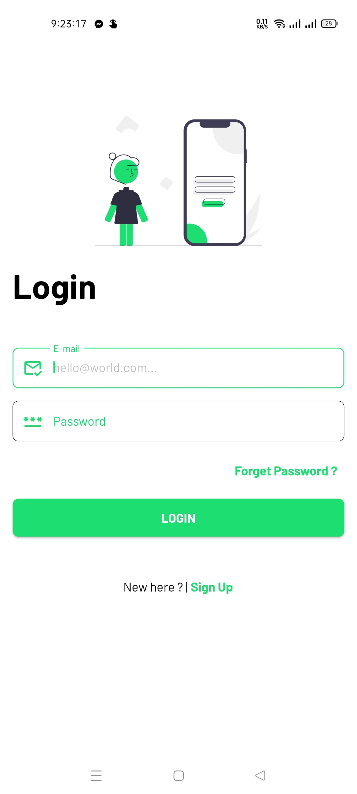
  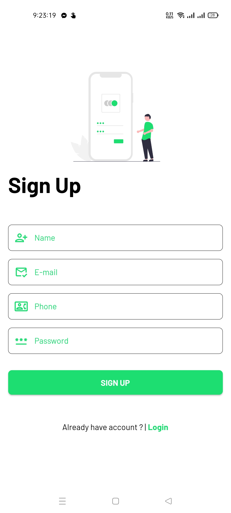
  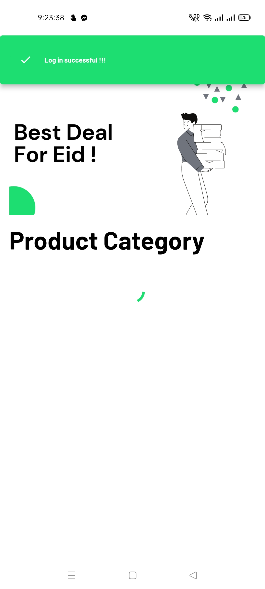
  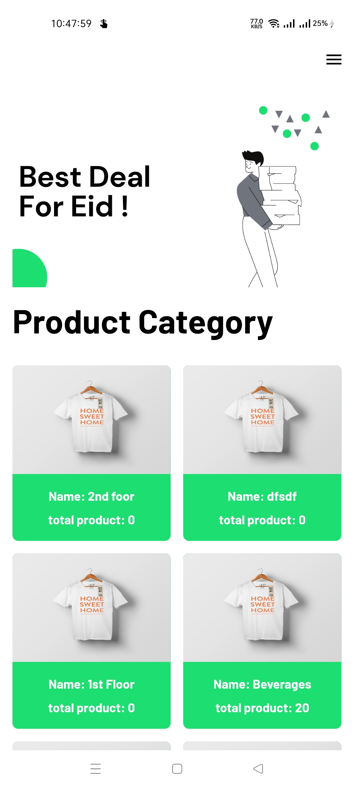
  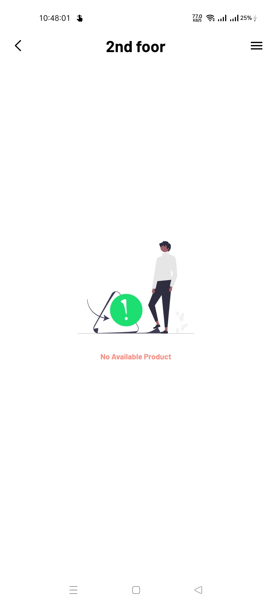
  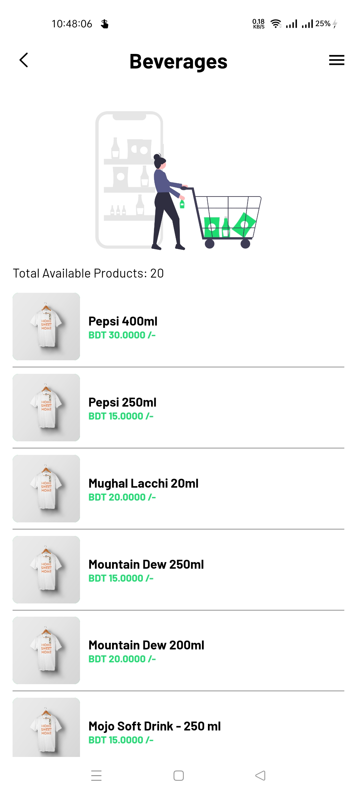
  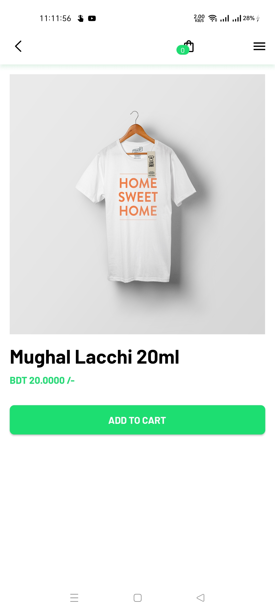
  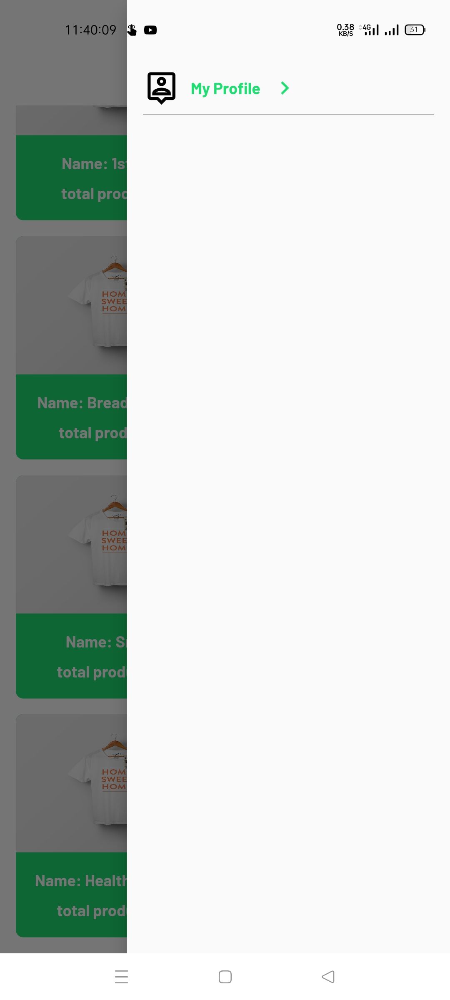
  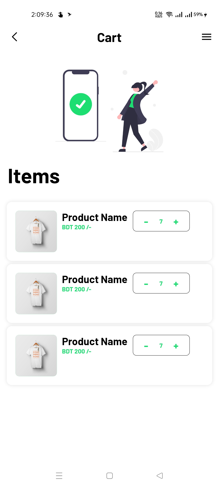
  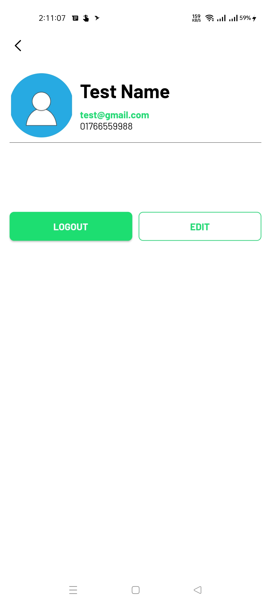
  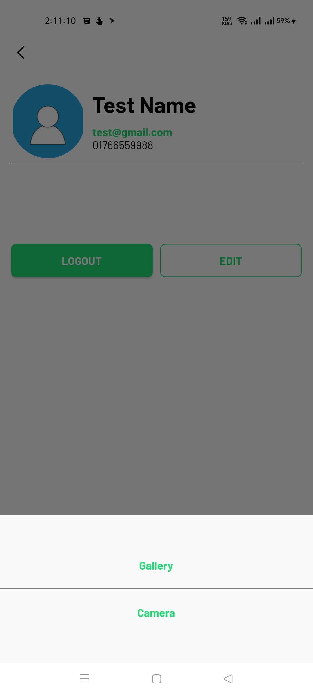

